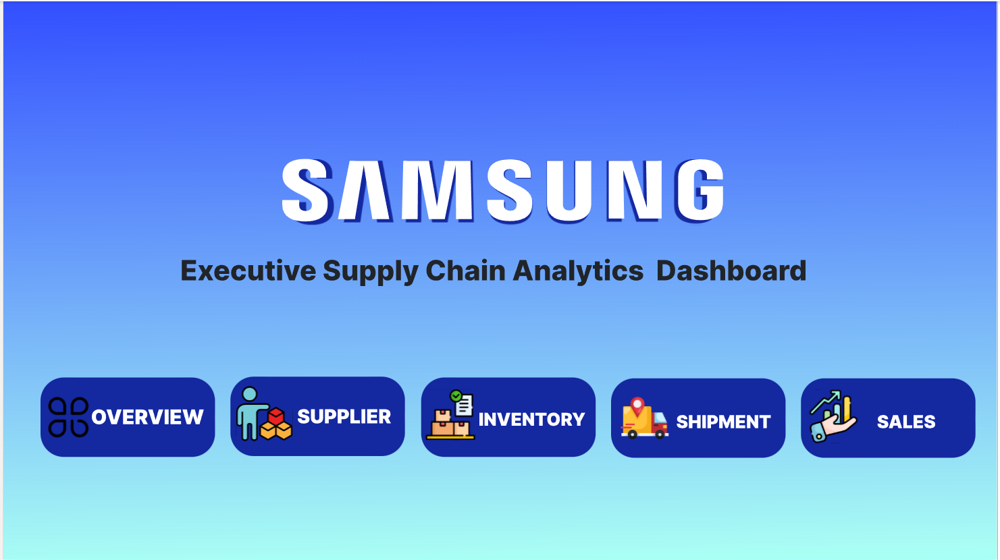
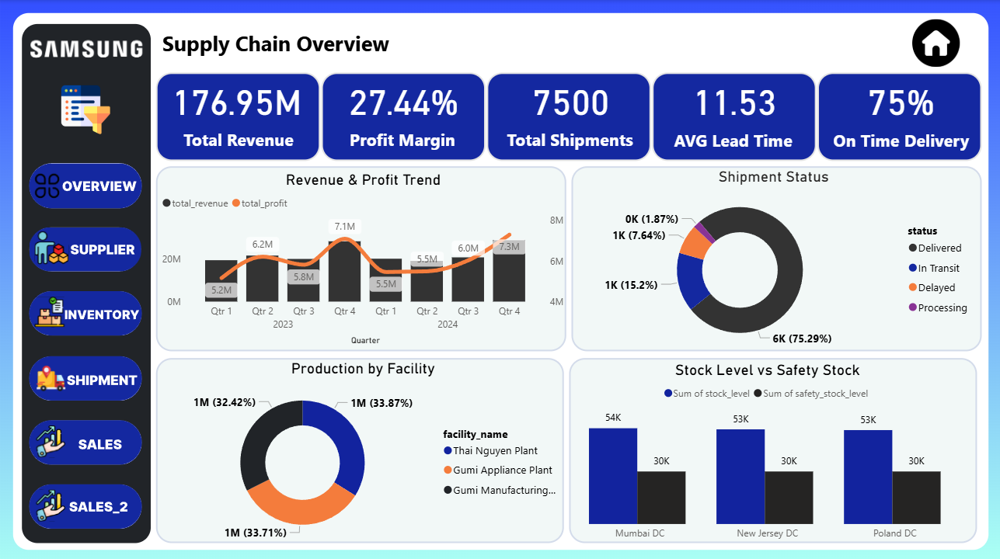
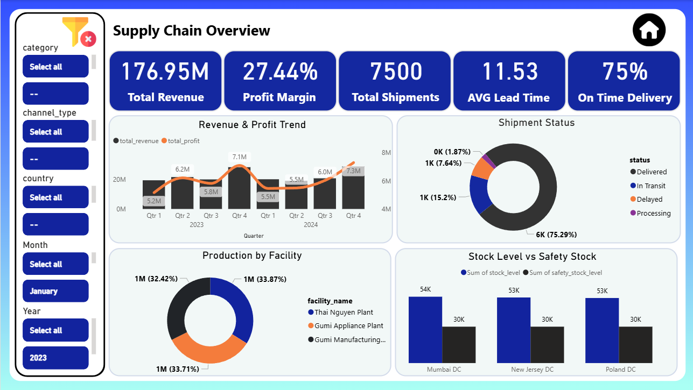
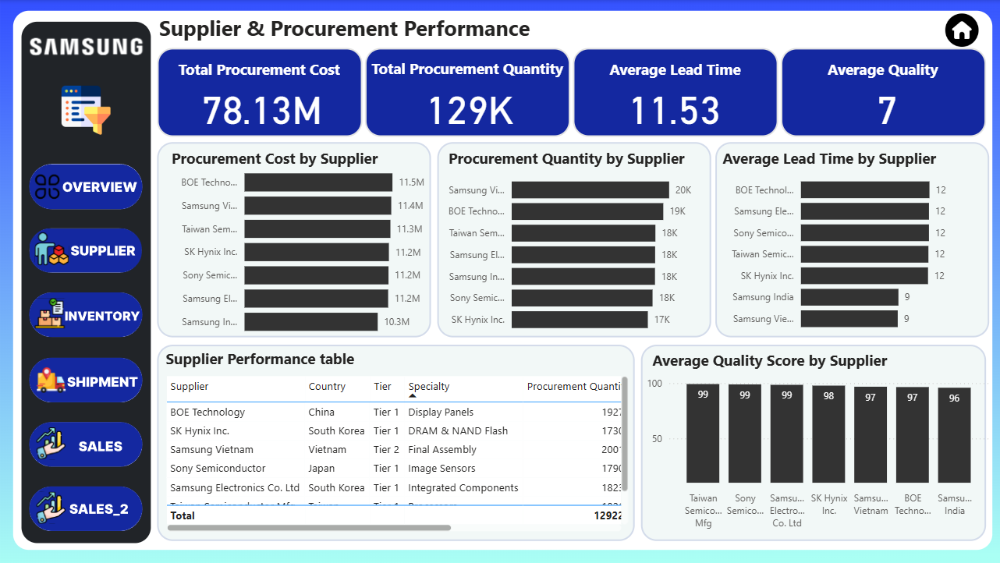
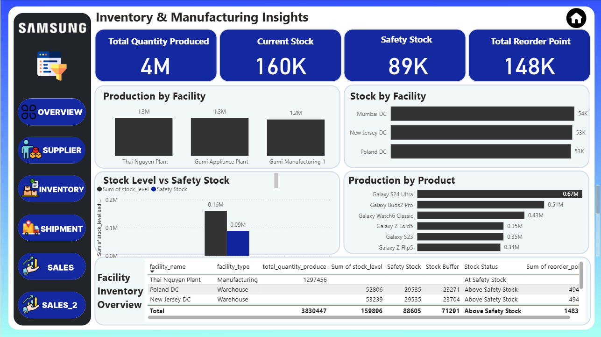
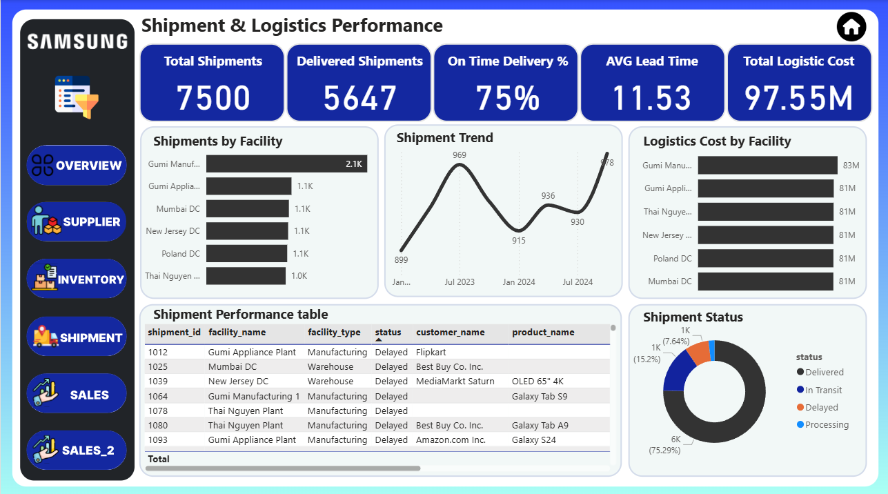
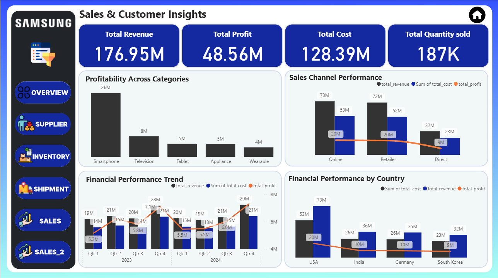
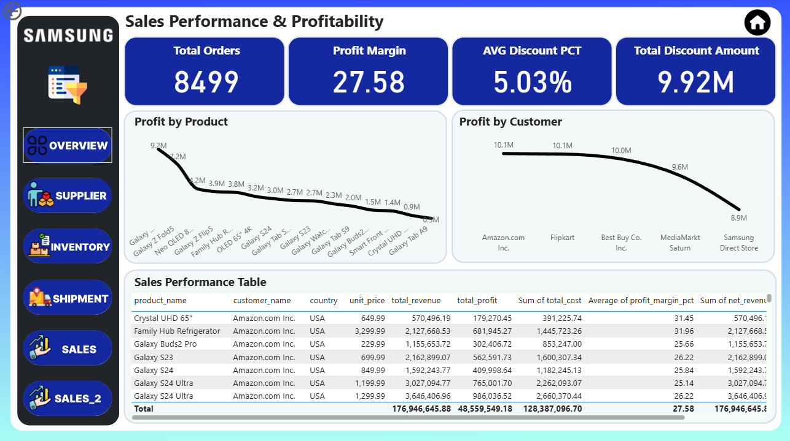
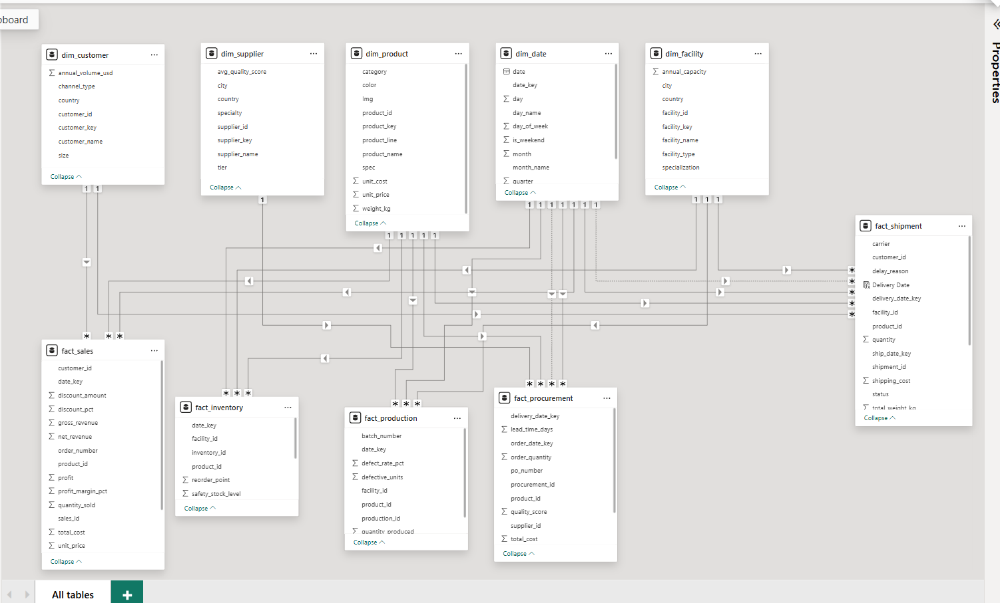

# Samsung Supply Chain Analytics

An end-to-end business intelligence project for analyzing Samsung's supply chain across **procurement, suppliers, manufacturing, inventory, logistics, sales, customers, and profitability**.

The project combines **data modeling, DAX, dashboard design, and business analysis** to build an interactive analytical solution from a multi-fact data model.

---

## 📊 Dashboard Preview

### 01 — Intro



### 02 — Supply Chain Overview



### 03 — Overview Filters



### 04 — Supplier & Procurement



### 05 — Inventory & Manufacturing



### 06 — Shipment & Logistics



### 07 — Sales & Customer Insights



### 08 — Sales Performance



---

## 📌 Project Overview

The project analyzes the main stages of a supply chain through a single Power BI analytical solution.

The business flow covered in the project is:

```text
Supplier
   ↓
Procurement
   ↓
Production
   ↓
Inventory
   ↓
Shipment
   ↓
Customer
   ↓
Sales
   ↓
Profitability
```

The dashboard allows performance to be analyzed across different business dimensions such as:

- Supplier
- Product
- Facility
- Customer
- Country
- Channel
- Date

The goal is to provide both **high-level performance monitoring** and **deeper operational analysis** within one interactive report.

---

## 🎯 Analysis Areas

### Supplier & Procurement

The procurement analysis focuses on:

- Procurement quantity
- Procurement cost
- Supplier lead time
- Supplier quality
- Supplier performance

### Inventory & Manufacturing

The manufacturing and inventory analysis covers:

- Production quantity
- Stock levels
- Safety stock
- Reorder points
- Stock buffer
- Production by facility
- Production by product

### Shipment & Logistics

The logistics analysis covers:

- Total shipments
- Delivered shipments
- On-time delivery
- Shipment status
- Logistics cost
- Quantity shipped
- Carrier analysis
- Facility analysis

### Sales & Customers

The sales analysis focuses on:

- Revenue
- Profit
- Cost
- Profit margin
- Quantity sold
- Orders
- Discounts
- Customer analysis
- Country analysis
- Channel analysis
- Product performance

---

## 🧩 Data Model

The analytical model follows a **Galaxy Schema / Constellation Schema** approach with shared dimensions and multiple fact tables.

### Dimensions

```text
dim_customer
dim_supplier
dim_product
dim_date
dim_facility
```

### Fact Tables

```text
fact_sales
fact_inventory
fact_production
fact_procurement
fact_shipment
```

The shared dimensions allow the different business processes to be analyzed consistently across the report.

### Model Structure



For the detailed table definitions:

→ [Data Model](data_modelling/Data_Model.md)

For the relationship structure:

→ [Relationships](data_modelling/Relationships.md)

---

## 🧮 DAX & KPIs

The project uses reusable DAX measures to calculate the main business KPIs across sales, procurement, production, inventory, and shipment processes.

### Sales

- Total Revenue
- Total Profit
- Profit Margin
- Total Cost
- Total Quantity Sold
- Total Orders

### Procurement

- Procurement Quantity
- Procurement Cost
- Average Lead Time

### Production

- Production Quantity

### Inventory

- Current Stock
- Safety Stock
- Reorder Point
- Stock Buffer
- Stock vs Safety %

### Shipment

- Total Shipments
- Delivered Shipments
- On-Time Delivery %
- Logistics Cost
- Quantity Shipped

Detailed DAX documentation:

→ [DAX Measures](power_bi/dax/Measures.md)

---

## 🛠️ Tools

| Tool | Purpose |
|---|---|
| 📊 Power BI | Data modeling, DAX, dashboard development, and interactive reporting |
| 🧮 DAX | KPI calculations and analytical measures |
| 🎨 Figma | Dashboard design and visual layout |

---

## 📁 Repository Structure

```text
Samsung_Supply_Chain_Analytics/
│
├── dashboard/
│   ├── design/
│   └── screenshots/
│       ├── 01_Intro.png
│       ├── 02_Overview.png
│       ├── 03_Supplier_Procurement.png
│       ├── 04_Inventory_Manufacturing.png
│       ├── 05_Shipment_Logistics.png
│       ├── 06_Sales_Customer_Insights.png
│       ├── 07_Sales_Performance.png
│       └── 08_Overview_Filters.png
│
├── data_modelling/
│   ├── Data_Model.md
│   ├── Data_Model.png
│   └── Relationships.md
│
├── dataset/
│
├── documentation/
│   ├── Business_Overview.md
│   ├── KPIs.md
│   └── Insights.md
│
├── power_bi/
│   ├── dax/
│   │   └── Measures.md
│   └── Supply Chain Analysis.pbix
│
└── README.md
```

---

## 📚 Documentation

| Document | Description |
|---|---|
| [Business Overview](documentation/Business_Overview.md) | Project scope and business context |
| [KPIs](documentation/KPIs.md) | KPI definitions and business usage |
| [Insights](documentation/Insights.md) | Analysis and findings from the dashboard |
| [Data Model](data_modelling/Data_Model.md) | Tables, columns, and model structure |
| [Relationships](data_modelling/Relationships.md) | Relationships between dimensions and facts |
| [DAX Measures](power_bi/dax/Measures.md) | Main DAX measures used in the report |

---

## 🔎 What This Project Demonstrates

This project brings together several core BI skills:

```text
Data Modeling
      ↓
DAX & Measures
      ↓
KPI Design
      ↓
Dashboard Design
      ↓
Business Analysis
```

The result is an interactive Power BI solution that connects operational and financial analysis across the supply chain.

---

## 📈 Project Scope

The project covers five main business processes:

| Business Process | Main Focus |
|---|---|
| Procurement | Suppliers, purchasing, cost, lead time, quality |
| Production | Production volume, facilities, products |
| Inventory | Stock levels, safety stock, reorder points |
| Logistics | Shipments, delivery performance, carriers, cost |
| Sales | Revenue, profit, customers, products, discounts |

---

## 📂 Project Files

### Power BI Report

The complete Power BI report is available here:

`power_bi/Supply Chain Analysis.pbix`

### Dashboard Screenshots

The exported dashboard pages are available in:

`dashboard/screenshots/`

### Data Model

The model documentation and visual representation are available in:

`data_modelling/`

---

## 👤 Project

**Samsung Supply Chain Analytics**

Built as a Business Intelligence portfolio project using Power BI, DAX, and Figma.
